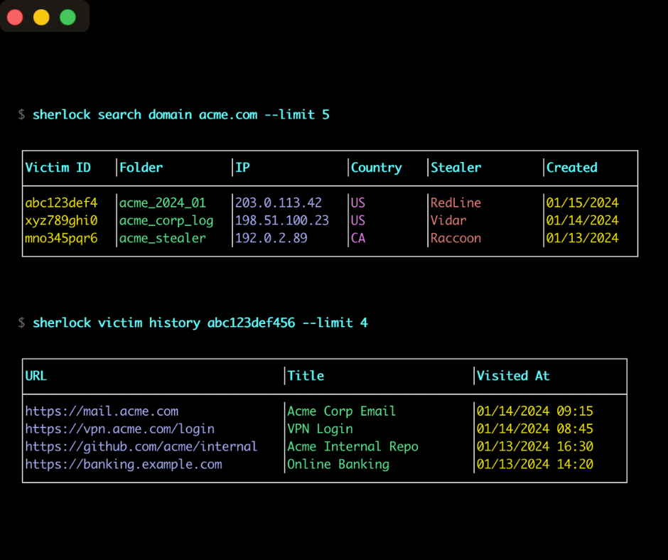

<div align="center">

# Sherlock



[](https://www.npmjs.com/package/@covertlabs/sherlock)
[](https://opensource.org/licenses/MIT)
[](https://nodejs.org/)
[](https://github.com/H4RR1SON/sherlock)
[](https://github.com/H4RR1SON/sherlock)

</div>

**A command-line tool for browsing infostealer logs and investigating compromised data.**

Sherlock is a CLI tool that lets you search through infostealer log datasets directly from your terminal. Investigate emails, IP addresses, browser history, cookies, credentials, and system profiles. No dashboards. No exports. One command, instant results.

Built by [Covertlabs](https://covertlabs.io) for security professionals who need to move fast.

## What You Get

- **Search infostealer logs**: query by email, domain, IP, username, password, country, stealer family, or free-text
- **Investigate compromised machines**: pull credentials, cookies, browser history, and system profiles for any victim
- **Multiple output formats**: tables for humans, JSON for scripts, CSV for spreadsheets
- **Secure authentication**: OS keychain storage, revocable tokens
- **Efficient pagination**: iterate through massive result sets without losing your place

## Installation

**Requirements**: Node.js 18+

```bash
npm install -g @covertlabs/sherlock
```

Verify it worked:

```bash
sherlock --help
```

## Quick Start

### 1. Authenticate

```bash
sherlock auth login
```

This opens a browser window. Sign in, grab your token, paste it back. Done.

### 2. Search Infostealer Logs

Search for compromised accounts by domain:

```bash
sherlock search domain acme.com --limit 20
```

Investigate by email address:

```bash
sherlock search email ceo@acme.com
```

Search by IP address:

```bash
sherlock search ip 203.0.113.50
```

Hunt by stealer family:

```bash
sherlock search stealer redline --limit 50
```

### 3. Investigate Compromised Data

Found a victim? Pull their full profile from the infostealer logs:

```bash
sherlock victim profile <victim_id> --include emails,domains
```

Investigate their stored credentials:

```bash
sherlock victim credentials <victim_id> --domain gmail.com
```

Extract their browser cookies:

```bash
sherlock victim cookies <victim_id> --domain slack.com
```

Review their browser history:

```bash
sherlock victim history <victim_id> --search banking
```

## Search Infostealer Logs

Search through infostealer log datasets to find compromised victims:

| Command | Description | Example |
|---------|-------------|---------|
| `search email` | Find victims by email address | `sherlock search email user@corp.com` |
| `search domain` | Find victims by domain | `sherlock search domain corp.com` |
| `search ip` | Find victims by IP address | `sherlock search ip 203.0.113.50` |
| `search username` | Find victims by username | `sherlock search username admin` |
| `search password` | Find victims by password | `sherlock search password "Summer2024!"` |
| `search country` | Find victims by country code | `sherlock search country US` |
| `search stealer` | Find victims by malware family | `sherlock search stealer vidar` |
| `search text` | Full-text search across all fields | `sherlock search text "vpn credentials"` |

All search commands support:
- `--limit <n>` - results per page (max 100)
- `--format table|json|csv` - output format
- `--cursor <cursor>` - pagination cursor for next page

## Investigate Compromised Data

Once you've found a victim in the infostealer logs, investigate their compromised data:

| Command | Description | Example |
|---------|-------------|---------|
| `victim profile` | Get victim metadata and summary | `sherlock victim profile <id>` |
| `victim credentials` | Investigate stored credentials | `sherlock victim credentials <id>` |
| `victim cookies` | Extract browser cookies | `sherlock victim cookies <id>` |
| `victim history` | Review browser history | `sherlock victim history <id>` |

Victim commands support:
- `--format table|json|csv` - output format
- `--limit <n>` - results per page
- `--offset <n>` - pagination offset
- `--domain <domain>` - filter by domain (credentials/cookies)
- `--search <term>` - filter history entries
- `--include <fields>` - include extra fields in profile (emails, domains, usernames)

## Output Formats

**Table** (default) - pretty-printed for terminal use:

```bash
sherlock search domain acme.com
```

**JSON** - pipe to `jq`, feed to scripts:

```bash
sherlock search domain acme.com --format json | jq '.results[].victim_id'
```

**CSV** - dump to spreadsheets:

```bash
sherlock search domain acme.com --format csv > results.csv
```

## Configuration

Your token is stored in your OS keychain (macOS Keychain, Windows Credential Manager, or Linux Secret Service). If keychain access isn't available, it falls back to an encrypted local config file.

### Environment Variables

| Variable | Description | Default |
|----------|-------------|---------|
| `SHERLOCK_API_URL` | API base URL | `https://api.covertlabs.io` |
| `SHERLOCK_API_TIMEOUT` | Request timeout (ms) | `30000` |
| `SHERLOCK_LOGIN_URL` | Browser login page URL | Auto-detected |
| `SHERLOCK_DEBUG` | Enable debug output | `false` |

### Persistent Configuration

After running `sherlock auth login`, your API URL and token are stored locally. You don't need to pass `--api-url` on every command.

Check your current config:

```bash
sherlock auth status
```

## Documentation

- [Getting Started](docs/getting-started.md) - zero to first query
- [Authentication](docs/auth.md) - how tokens work, security considerations
- [Command Reference](docs/commands.md) - every command, every flag
- [Configuration](docs/configuration.md) - environment variables, output formats
- [Security](docs/security.md) - token handling, storage, best practices
- [Troubleshooting](docs/troubleshooting.md) - common errors and fixes

## Use Cases

**Incident Response**: Your organization got phished. Search infostealer logs by your domain to find which employees have compromised credentials. Investigate their browser history, cookies, and stored passwords to understand the blast radius.

**Red Team Operations**: Before an engagement, search infostealer logs for the target's domain. Existing credentials are often still valid. Pull IP addresses, browser history, and cookies to build your attack surface.

**Threat Intelligence**: Track stealer families across infostealer logs. Monitor specific countries or IP ranges. Investigate email addresses and domains to map threat actor infrastructure.

**Credential Monitoring**: Integrate with your SIEM. Run scheduled searches across infostealer logs. Alert when new compromises appear for your domain or email addresses.

## Support

**Customers**: Use your normal support channel or email support@covertlabs.io

**Security Issues**: Report vulnerabilities to security@covertlabs.io

## License

MIT - see [LICENSE](LICENSE) for details.

---

Built with conviction by [Covertlabs](https://covertlabs.io). The data exists. You might as well know about it.
