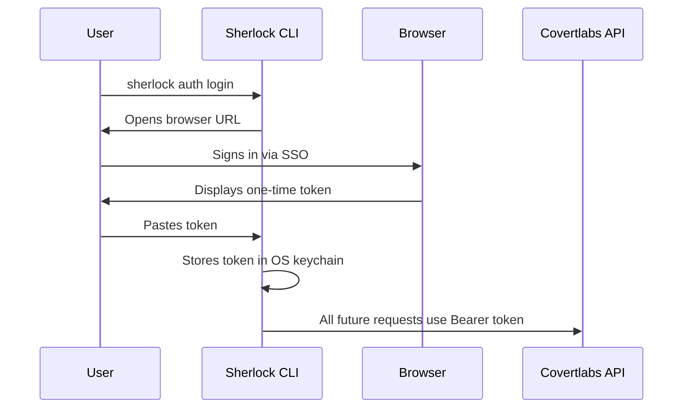

# Sherlock

**The command-line interface for threat intelligence professionals who don't have time for bullshit.**

Sherlock gives you instant access to stealer log datasets—credentials, cookies, browser history, system profiles—from your terminal. No clicking through dashboards. No waiting for exports. One command, real answers.

Built by [Covertlabs](https://covertlabs.io) for incident responders, red teamers, and security researchers who need to move fast.

## What You Get

- **8 search vectors**: email, domain, IP, username, password, country, stealer family, free-text
- **Deep victim profiling**: pull credentials, cookies, and browser history for any compromised machine
- **Multiple output formats**: tables for humans, JSON for scripts, CSV for spreadsheets
- **Secure token auth**: OS keychain storage, revocable PATs, no passwords flying around
- **Cursor-based pagination**: iterate through massive result sets without losing your place

## Installation

**Requirements**: Node.js 18+

```bash
npm install -g @covertlabs/sherlock
```

Verify it worked:

```bash
sherlock --help
```

## Quick Start

### 1. Authenticate

```bash
sherlock auth login --api-url https://api.covertlabs.io
```

This opens a browser window. Sign in, grab your token, paste it back. Done.

### 2. Search

Find compromised accounts by domain:

```bash
sherlock search domain acme.com --limit 20
```

Search by email:

```bash
sherlock search email ceo@acme.com
```

Hunt by stealer family:

```bash
sherlock search stealer redline --limit 50
```

### 3. Go Deep

Found something interesting? Pull the full victim profile:

```bash
sherlock victim profile <victim_id> --include emails,domains
```

Grab their stored credentials:

```bash
sherlock victim credentials <victim_id> --domain gmail.com
```

Extract browser cookies:

```bash
sherlock victim cookies <victim_id> --domain slack.com
```

Review their browsing history:

```bash
sherlock victim history <victim_id> --search banking
```

## Search Commands

| Command | Description | Example |
|---------|-------------|---------|
| `search email` | Find victims by email address | `sherlock search email user@corp.com` |
| `search domain` | Find victims by domain | `sherlock search domain corp.com` |
| `search ip` | Find victims by IP address | `sherlock search ip 203.0.113.50` |
| `search username` | Find victims by username | `sherlock search username admin` |
| `search password` | Find victims by password | `sherlock search password "Summer2024!"` |
| `search country` | Find victims by country code | `sherlock search country US` |
| `search stealer` | Find victims by malware family | `sherlock search stealer vidar` |
| `search text` | Full-text search across all fields | `sherlock search text "vpn credentials"` |

All search commands support:
- `--limit <n>` — results per page (max 100)
- `--format table|json|csv` — output format
- `--cursor <cursor>` — pagination cursor for next page

## Victim Commands

| Command | Description | Example |
|---------|-------------|---------|
| `victim profile` | Get victim metadata and summary | `sherlock victim profile <id>` |
| `victim credentials` | List stored credentials | `sherlock victim credentials <id>` |
| `victim cookies` | List browser cookies | `sherlock victim cookies <id>` |
| `victim history` | List browser history | `sherlock victim history <id>` |

Victim commands support:
- `--format table|json|csv` — output format
- `--limit <n>` — results per page
- `--offset <n>` — pagination offset
- `--domain <domain>` — filter by domain (credentials/cookies)
- `--search <term>` — filter history entries
- `--include <fields>` — include extra fields in profile (emails, domains, usernames)

## Output Formats

**Table** (default) — pretty-printed for terminal use:

```bash
sherlock search domain acme.com
```

**JSON** — pipe to `jq`, feed to scripts:

```bash
sherlock search domain acme.com --format json | jq '.results[].victim_id'
```

**CSV** — dump to spreadsheets:

```bash
sherlock search domain acme.com --format csv > results.csv
```

## Authentication Flow



Your token is stored in your OS keychain (macOS Keychain, Windows Credential Manager, or Linux Secret Service). If keychain access isn't available, it falls back to an encrypted local config file.

## Configuration

### Environment Variables

| Variable | Description | Default |
|----------|-------------|---------|
| `SHERLOCK_API_URL` | API base URL | `https://api.covertlabs.io` |
| `SHERLOCK_API_TIMEOUT` | Request timeout (ms) | `30000` |
| `SHERLOCK_LOGIN_URL` | Browser login page URL | Auto-detected |
| `SHERLOCK_DEBUG` | Enable debug output | `false` |

### Persistent Configuration

After running `sherlock auth login`, your API URL and token are stored locally. You don't need to pass `--api-url` on every command.

Check your current config:

```bash
sherlock auth status
```

## Documentation

- [Getting Started](docs/getting-started.md) — zero to first query
- [Authentication](docs/auth.md) — how tokens work, security considerations
- [Command Reference](docs/commands.md) — every command, every flag
- [Configuration](docs/configuration.md) — environment variables, output formats
- [Security](docs/security.md) — token handling, storage, best practices
- [Troubleshooting](docs/troubleshooting.md) — common errors and fixes

## Use Cases

**Incident Response**: Your organization got phished. Search by your domain to find which employees have compromised credentials in stealer logs. Pull their credentials to understand the blast radius.

**Red Team Operations**: Before an engagement, search for the target's domain. Existing credentials in stealer logs are often still valid—and they're not technically "hacking."

**Threat Intelligence**: Track stealer families. Monitor specific countries. Build datasets for research.

**Credential Monitoring**: Integrate with your SIEM. Run scheduled searches. Alert when new compromises appear.

## Support

**Customers**: Use your normal support channel or email support@covertlabs.io

**Security Issues**: Report vulnerabilities to security@covertlabs.io

## License

MIT — see [LICENSE](LICENSE) for details.

---

Built with conviction by [Covertlabs](https://covertlabs.io). The data exists. You might as well know about it.
