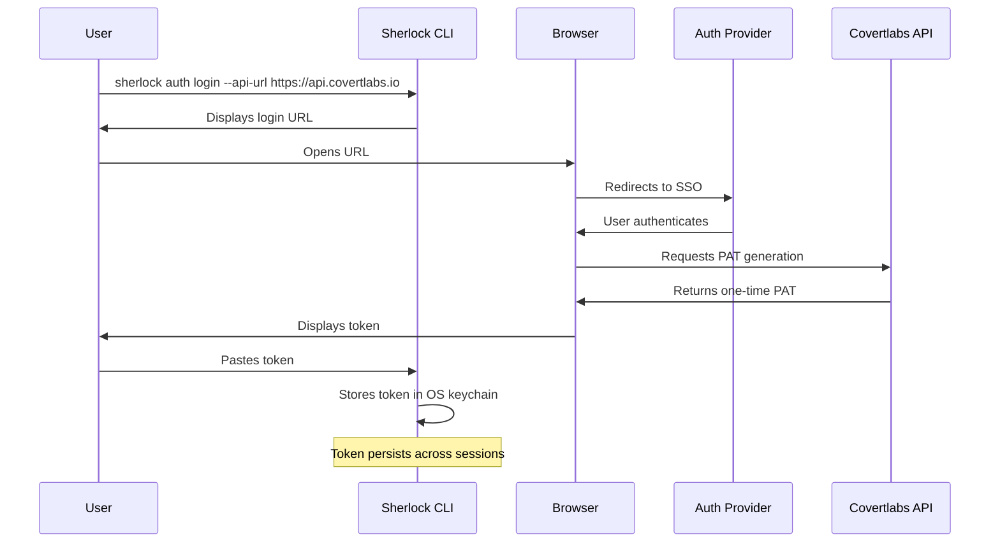

# Authentication

Sherlock uses **Personal Access Tokens (PATs)** for authentication. Not OAuth flows. Not session cookies. Not API keys you rotate every 90 days because compliance said so.

PATs are simple: generate one, paste it, get to work.

## Why PATs

- **Long-lived** — authenticate once, work for months
- **Revocable** — compromised token? Kill it server-side instantly
- **Auditable** — every request is tied to a specific token
- **Portable** — same token works on your laptop, your CI pipeline, your scripts

## The Login Flow

Here's what happens when you run `sherlock auth login`:



1. You run `sherlock auth login`
2. CLI prints a URL to open in your browser
3. You sign in via SSO (WorkOS AuthKit)
4. The browser page generates a one-time PAT
5. You copy the token and paste it into the CLI
6. CLI stores it in your OS keychain

From then on, every command uses that token automatically.

## Token Storage

Sherlock tries to store your token in the most secure location available:

| Platform | Primary Storage | Fallback |
|----------|-----------------|----------|
| macOS | Keychain | `~/.config/sherlock/config.json` |
| Windows | Credential Manager | `%APPDATA%/sherlock/config.json` |
| Linux | Secret Service (GNOME Keyring, KWallet) | `~/.config/sherlock/config.json` |

The fallback config file is only used when keychain access fails (headless servers, containers, etc.).

## Commands

### Login

```bash
sherlock auth login --api-url https://api.covertlabs.io
```

**Flags:**
- `--api-url <url>` — API base URL (required on first login)
- `--token <token>` — skip the browser flow, paste token directly
- `--login-url <url>` — override the browser login page URL

**Examples:**

Interactive login (opens browser):
```bash
sherlock auth login --api-url https://api.covertlabs.io
```

Non-interactive login (CI/CD):
```bash
sherlock auth login --api-url https://api.covertlabs.io --token "$SHERLOCK_TOKEN"
```

### Check Status

```bash
sherlock auth status
```

Shows whether you have a stored token and what API URL is configured.

### Logout

```bash
sherlock auth logout
```

Removes your stored token from the keychain/config. You'll need to re-authenticate.

## Environment Variables

You can skip the login flow entirely by setting environment variables:

```bash
export SHERLOCK_API_URL="https://api.covertlabs.io"
# Token must still be obtained via browser flow and stored
```

For CI/CD pipelines, you typically:
1. Generate a token manually once
2. Store it in your CI secrets
3. Pass it via `--token` flag or store it during setup

## Token Security

**Treat PATs like passwords.** They grant full access to your account.

### Do

- Store tokens in CI/CD secrets managers
- Generate separate tokens for different machines/pipelines
- Revoke tokens you no longer need
- Rotate tokens periodically (quarterly is reasonable)

### Don't

- Commit tokens to git
- Paste tokens in Slack/email
- Share tokens between team members
- Screenshot tokens

### If a Token is Compromised

1. Log into the Covertlabs dashboard
2. Navigate to API Tokens
3. Revoke the compromised token
4. Generate a new one
5. Update your CLI: `sherlock auth login`

The compromised token stops working immediately upon revocation.

## Headless/Server Authentication

For servers without a browser:

1. Generate a token on a machine with a browser
2. Copy the token securely to your server
3. Run:

```bash
sherlock auth login --api-url https://api.covertlabs.io --token "your-token-here"
```

Or set it in your environment:

```bash
echo 'export SHERLOCK_API_URL="https://api.covertlabs.io"' >> ~/.bashrc
sherlock auth login --token "your-token-here"
```

## Troubleshooting

**"Not authenticated" errors**
```bash
sherlock auth status  # Check if token exists
sherlock auth login   # Re-authenticate
```

**Token not persisting**
- Keychain access might be blocked
- Check if `~/.config/sherlock/` is writable
- Try running with `--token` flag directly

**Wrong API URL**
```bash
sherlock auth login --api-url https://api.covertlabs.io
```

This overwrites the stored URL.

---

More questions? See [Troubleshooting](troubleshooting.md) or [Security](security.md).
